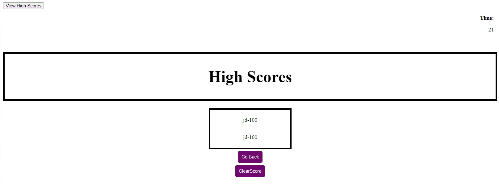

# 04 Web APIs: Code Quiz

## Task

This Challenge display a build timed coding quiz with multiple-choice questions. This app will run in the browser and will feature dynamically updated HTML and CSS powered by JavaScript code that was written. It will have a clean, polished, and responsive user interface. 

## GitHub URL:
<br><br><br>

## User Story

```
AS A coding boot camp student
I WANT to take a timed quiz on JavaScript fundamentals that stores high scores
SO THAT I can gauge my progress compared to my peers
```

## Acceptance Criteria

```
GIVEN I am taking a code quiz
WHEN I click the start button
THEN a timer starts and I am presented with a question
WHEN I answer a question
THEN I am presented with another question
WHEN I answer a question incorrectly
THEN time is subtracted from the clock
WHEN all questions are answered or the timer reaches 0
THEN the game is over
WHEN the game is over
THEN I can save my initials and my score
```

## Mock-Up

The following animation demonstrates the application functionality:


Image of multiple attempt for this Quiz


## Grading Requirements - Missing Items (Errors)

 <li> Have not been doing multiple committes. All changes has been local.</li> <br>
 <li> "View High Scores" link in the top left corner is not working.</li> <br>
 <li> User is able to change choice after view answer.</li> <br>


---

© 2023 edX Boot Camps LLC. Confidential and Proprietary. All Rights Reserved.
